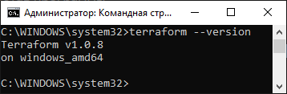
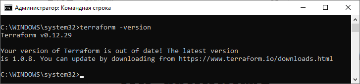
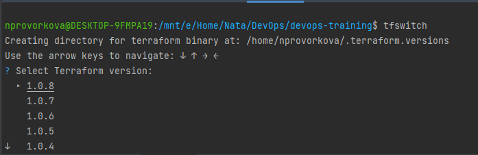

### 7.1. Инфраструктура как код - Проворкова Наталия
#### 1. Выбор инструментов:

1. Какой тип инфраструктуры будем использовать для этого проекта: изменяемый или не изменяемый?
 <b>Неизменяемый, чтобы не городить огород из приписок к первоначальному описанию инфраструктуры. Новая инфраструктура - новый образ.</b>
     
2. Будет ли центральный сервер для управления инфраструктурой?
 <b>Без центрального сервера,так как первое время будет один внешний клиент, не стоит тратить ресурсы на поддержание дополнительной инфраструктуры.</b>
      
3. Будут ли агенты на серверах?
 <b>Агентов не будет, чтобы не устанавливать их на сервера, когда клиентов будет много.</b>
      
4. Будут ли использованы средства для управления конфигурацией или инициализации ресурсов?
 <b>Будет использован инструмент инициализации ресурсов, основная цель которого - предоставлять ресурсы. </b>
   
Какие инструменты из уже используемых вы хотели бы использовать для нового проекта?
<b>
* Packer-образы
* Terraform
* Docker
* Kubernetes 
* Teamcity</b>
	
Хотите ли рассмотреть возможность внедрения новых инструментов для этого проекта?
 <b>Да, мы открыты предложениям, если они будут в процессе совещания</b>

#### 2. Установка терраформ
Вывод команды `terraform --version`:
 

#### 3. Поддержка легаси кода
Вывод `--version` двух версий терраформа доступных на компьютере:
 

Выбор версии с помощью tfswith:
 