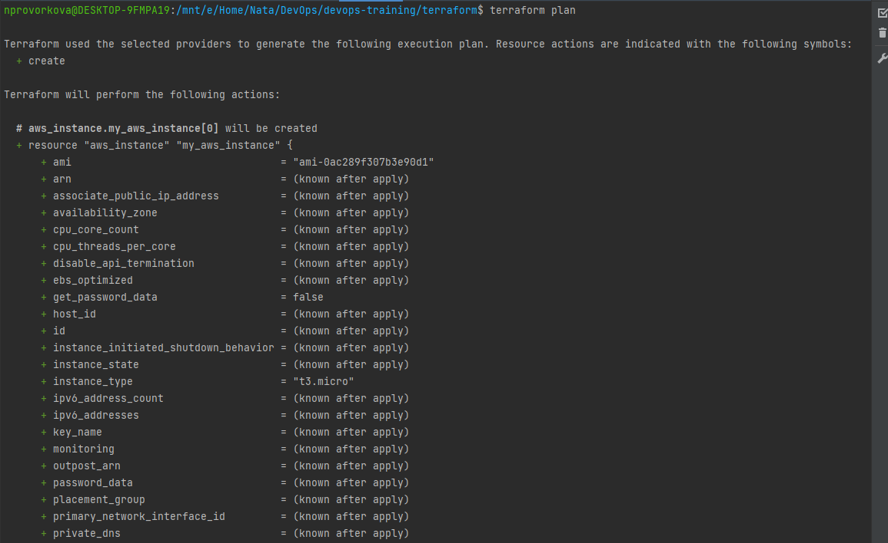
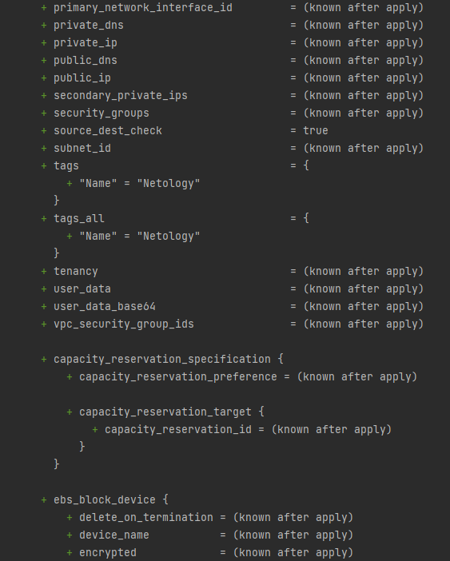
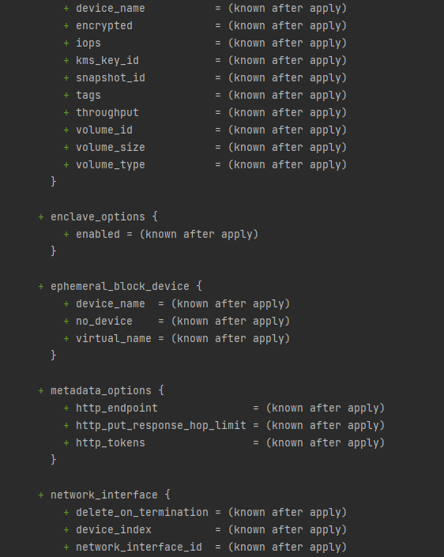
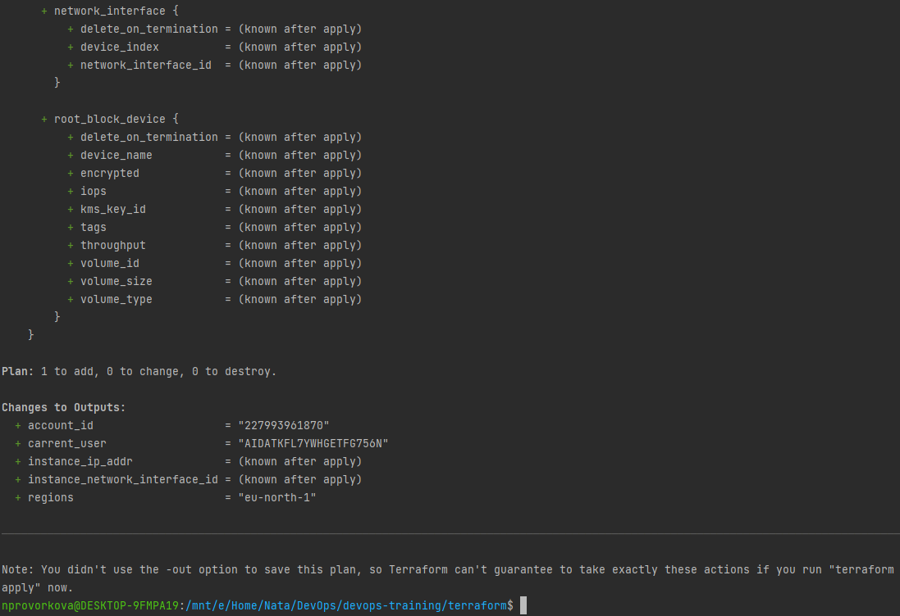

### 7.2. Облачные провайдеры и синтаксис Terraform - Проворкова Наталия
#### 1.1. (вариант с AWS). Регистрация в aws и знакомство с основами

#### 1.2. (Вариант с Yandex.Cloud). Регистрация в aws и знакомство с основами

#### 2. Создание aws ec2 или yandex_compute_instance через терраформ.
 1. Packer
 2. [Ссылка на репозиторий](https://github.com/nprovorkova/devops-training)
   
 
 
 
 