### 7.3. Основы и принцип работы Терраформ - Наталия Проворкова
#### 1. Создадим бэкэнд в S3 (необязательно, но крайне желательно).
provider "aws" {
 &nbsp;  region = "eu-north-1"
  }

 terraform {
 &nbsp;  backend "s3" {
 &nbsp;&nbsp;    bucket = "netology-state-dev"
 &nbsp;&nbsp;    key    = "bucket-key-path"
 &nbsp;&nbsp;    region = "eu-north-1"
 &nbsp;  }
 }

 data "terraform_remote_state" "network" {
 &nbsp;  backend = "s3"
 &nbsp;  config = {
 &nbsp;&nbsp;    bucket = "netology-state-dev"
 &nbsp;&nbsp;    key    = format( "env:/%s/bucket-key-path", terraform.workspace)
 &nbsp;&nbsp;    region = "eu-north-1"
 &nbsp;  }
 }

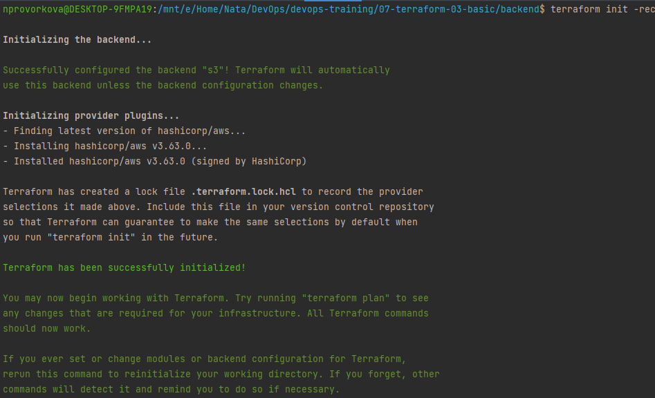

#### 2. Инициализируем проект и создаем воркспейсы.
1. workspace list
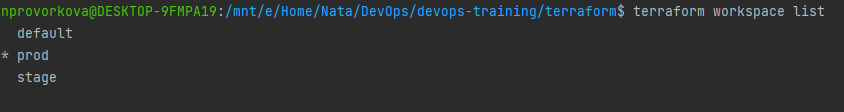
2. terraform plan for prod-workspace
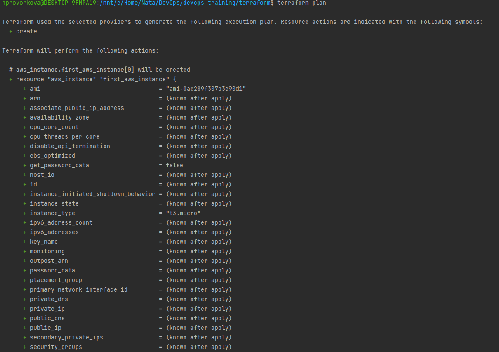
    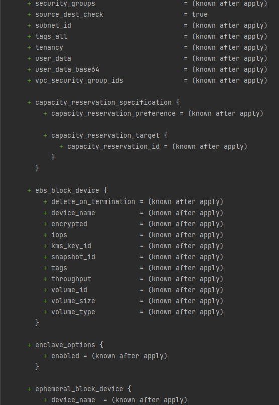
    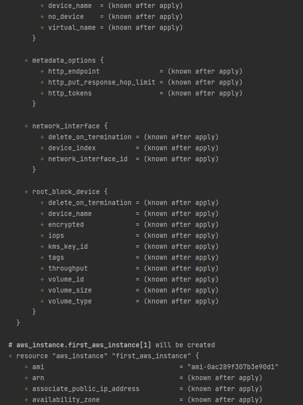
    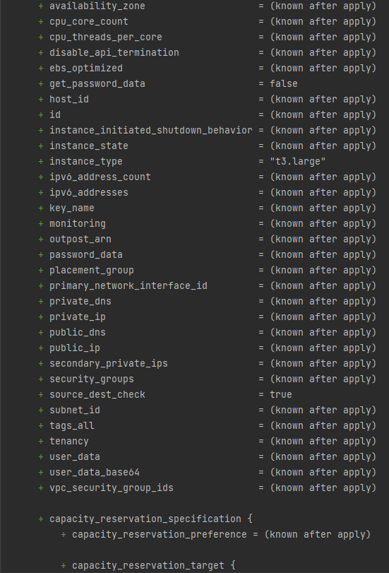
    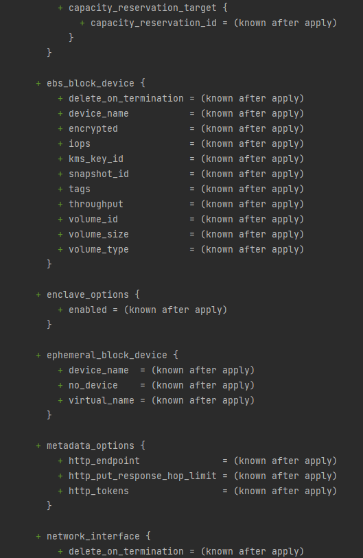
    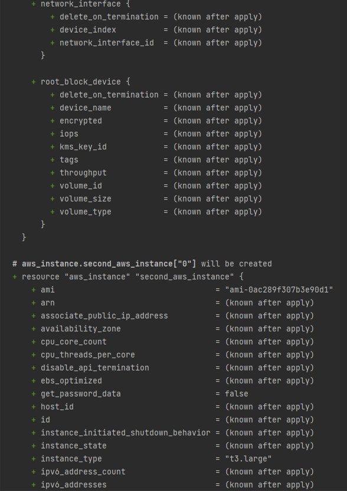
    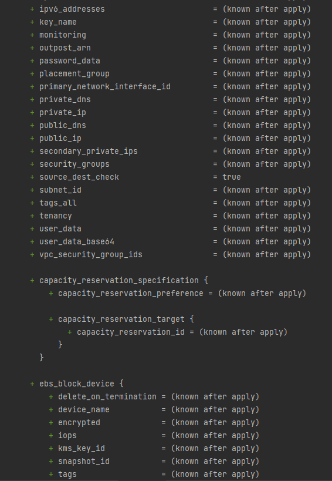
    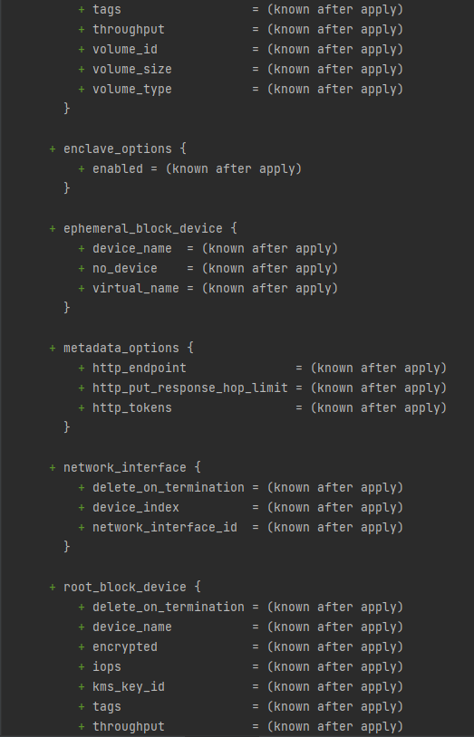
    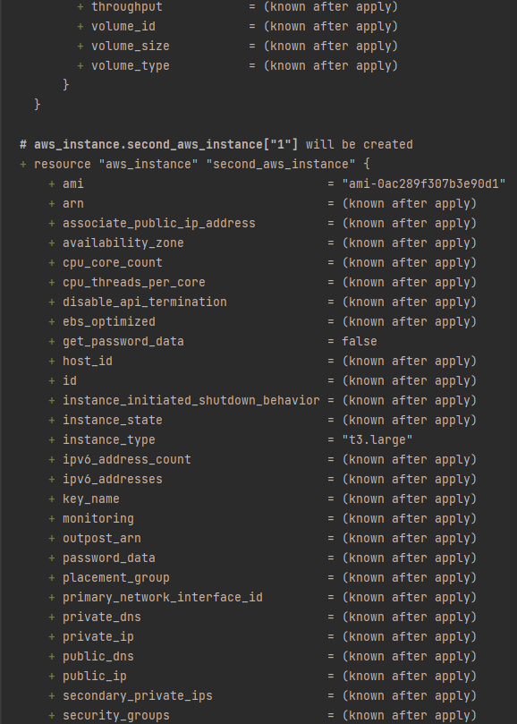
    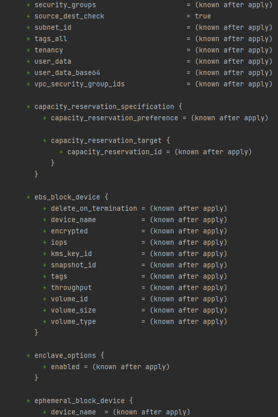
    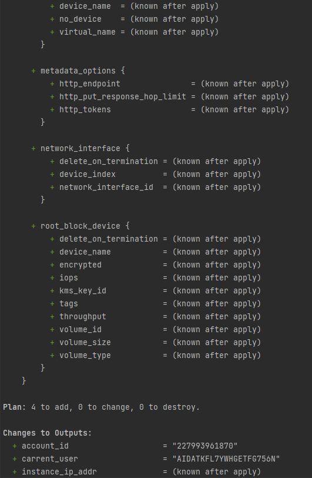
    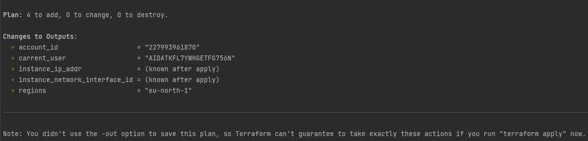