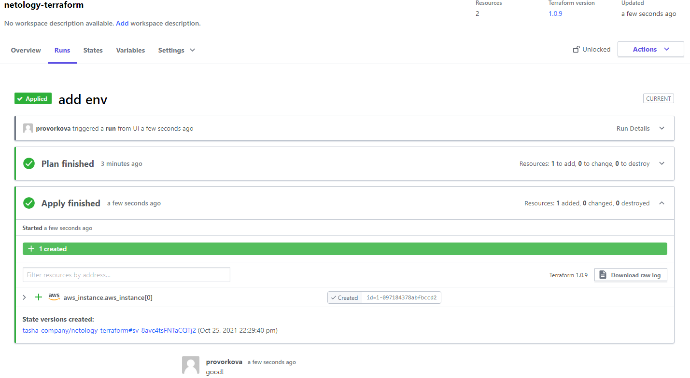

### 7.4. Средства командной работы над инфраструктурой - Наталия Проворкова
#### 1. Настроить terraform cloud (необязательно, но крайне желательно)

#### 2. Написать серверный конфиг для атлантиса
[server.yaml](https://github.com/nprovorkova/devops-training/blob/master/07-terraform-04-teamwork/atlantis/server.yaml)
 [atlantis.yaml](https://github.com/nprovorkova/devops-training/blob/master/07-terraform-04-teamwork/atlantis/atlantis.yaml)

#### 3. Знакомство с каталогом модулей

На мой взгляд проще создать ec2 самостоятельно (так как это не сложно), чем разбираться, какие ключи настраивать в модуле

[main.tf](https://github.com/nprovorkova/devops-training/blob/master/07-terraform-04-teamwork/main.tf)
