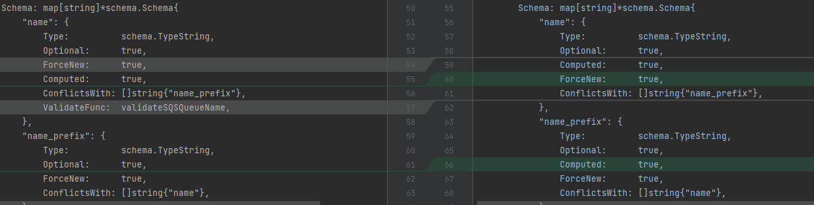
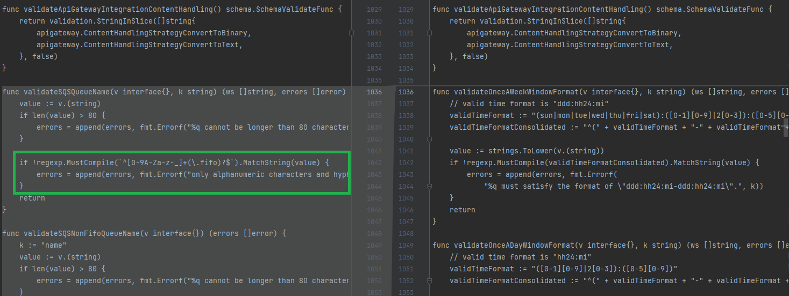

### 7.6. Написание собственных провайдеров для Terraform - Наталия Проворкова
#### 1. Написание кода
1. Перечислены все доступные resource и data_source: 
 [DataSourcesMap](https://github.com/hashicorp/terraform-provider-aws/blob/6076d5a60ec814b243bc45170d67cb268a39d927/internal/provider/provider.go#L338)
 [ResourcesMap](https://github.com/hashicorp/terraform-provider-aws/blob/6076d5a60ec814b243bc45170d67cb268a39d927/internal/provider/provider.go#L709)
2. Для создания очереди сообщений SQS используется ресурс aws_sqs_queue у которого есть параметр name
* [Параметр name конфликтует c параметром name_prefix](https://github.com/hashicorp/terraform-provider-aws/blob/6076d5a60ec814b243bc45170d67cb268a39d927/internal/service/sqs/queue.go#L97)
* Валидация на имя удалена, ранее длина имени не должна была превышать 80 символов:

* До удаления валидации имя должно было подчиняться регулярному выражению `^[0-9A-Za-z-_]+(\.fifo)?$`:

