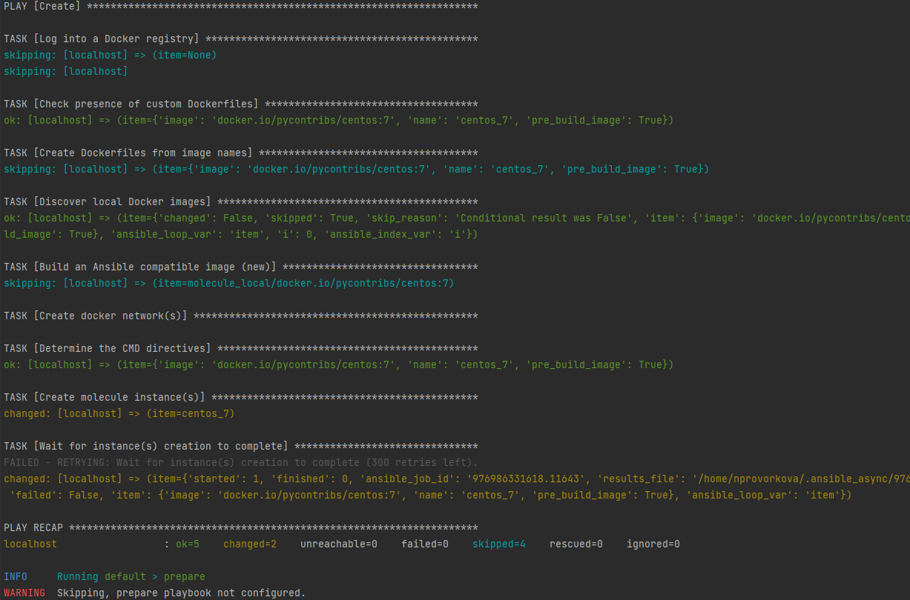

### 8.5 Тестирование Roles - Наталия Проворкова
#### 0. Репозитории с решением
https://github.com/nprovorkova/kibana-role.git
 https://github.com/nprovorkova/filebeat-role.git
#### Molecule kibana-role
###### 1. Запустите molecule test внутри корневой директории elasticsearch-role, посмотрите на вывод команды.
#### 2. Перейдите в каталог с ролью kibana-role и создайте сценарий тестирования по умолчаню при помощи molecule init scenario --driver-name docker.

###### 3. Добавьте несколько разных дистрибутивов (centos:8, ubuntu:latest) для инстансов и протестируйте роль, исправьте найденные ошибки, если они есть.
#### 4. Добавьте несколько assert'ов в verify.yml файл, для проверки работоспособности kibana-role (проверка, что web отвечает, проверка логов, etc). Запустите тестирование роли повторно и проверьте, что оно прошло успешно.

###### 5. Повторите шаги 2-4 для filebeat-role.
###### 6. Добавьте новый тег на коммит с рабочим сценарием в соответствии с семантическим версионированием.

#### Molecule filebeat-role
#### 2. Перейдите в каталог с ролью kibana-role и создайте сценарий тестирования по умолчаню при помощи molecule init scenario --driver-name docker.

###### 3. Добавьте несколько разных дистрибутивов (centos:8, ubuntu:latest) для инстансов и протестируйте роль, исправьте найденные ошибки, если они есть.
#### 4. Добавьте несколько assert'ов в verify.yml файл, для проверки работоспособности kibana-role (проверка, что web отвечает, проверка логов, etc). Запустите тестирование роли повторно и проверьте, что оно прошло успешно.

