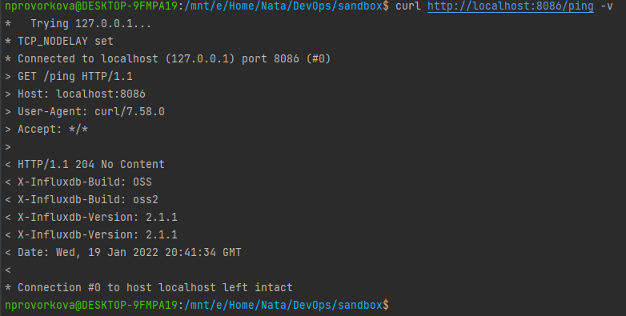
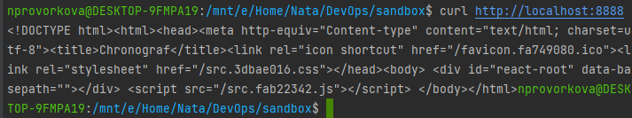
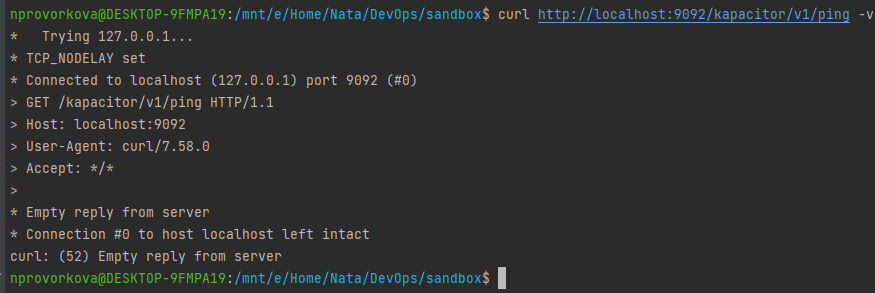
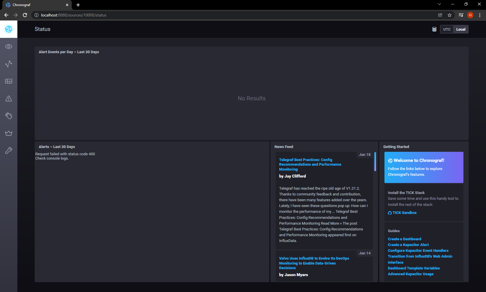
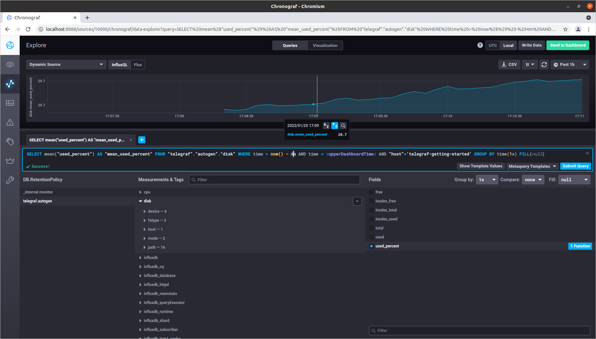
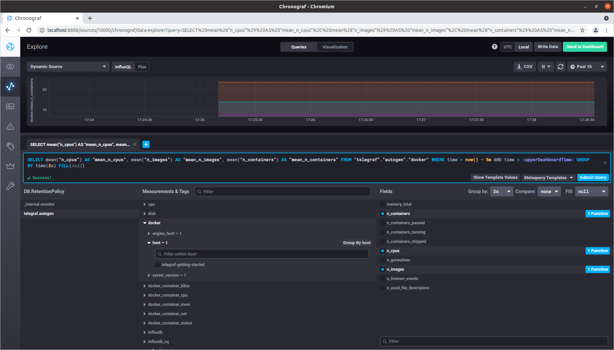

### 10.2. Системы мониторинга - Наталия Проворкова
#### 1. Опишите основные плюсы и минусы pull и push систем мониторинга.
###### Плюсы Pull-модели:
* Могут принимать кастомные метрики, когда разработчики решат их добавить
* Стирают грань между метриками, событиями и даже журналами, смешивая их все вместе. Это обеспечивает гораздо более богатые запросы, визуализацию и решение проблем
* Всегда известен источник метрики

###### Минусы Pull-модели:
* Агентам часто требуется поддерживать состояние, чтобы опросчик мог получить метрики позже
* Протокол опроса может открыть систему для удаленного доступа
* Отсутствие масштабируемости при опросе обычно означает, что измерения извлекаются реже, что делает систему управления менее восприимчивой к изменениям

###### Плюсы Push-модели:
* Все централизовано, поэтому очень легко вносить изменения: можно часто добавлять или отключать метрики
* Можно изменять частоту забора метрик у отдельных групп проблемных хостов
* Часто имеют шаблоны, позволяющие очень быстро и легко определять новые хосты и службы, наследуя все, что им нужно, из существующих шаблонов. Это позволяет нам за считанные секунды настроить комплексный мониторинг новых хостов, автоматически наследуя проверенные годами лучшие практики.
* Скорость обнаружения метрики не зависит от количества агентов
* Защищены от удаленных атак, так как не прослушивают сетевые подключения
* Для агентов требуется минимальная настройка

###### Минусы Push-модели:
* Требует линейной масштабируемости
* Негибкая: периодически экспортируется предварительно определенный фиксированный набор измерений
* Есть риск потери данных

#### 2. Какие из ниже перечисленных систем относятся к push модели, а какие к pull? А может есть гибридные?

* Prometheus - гибридная (но в основном pull)
* TICK - гибридная
* Zabbix - гибридная
* VictoriaMetrics - гибридная (но в основном push)
* Nagios - pull

#### 3. Склонируйте себе репозиторий и запустите TICK-стэк, используя технологии docker и docker-compose. P.S.: если при запуске некоторые контейнеры будут падать с ошибкой - проставьте им режим Z, например ./data:/var/lib:Z
- curl http://localhost:8086/ping
<br>
- curl http://localhost:8888
  <br>
- curl http://localhost:9092/kapacitor/v1/ping
  <br>
- веб-интерфейс ПО chronograf (http://localhost:8888).
  <br>

#### 4. Перейдите в веб-интерфейс Chronograf (http://localhost:8888) и откройте вкладку Data explorer.
В конфигурацию telegraf добавлены плагины [[inputs.mem]] и [[inputs.disk]]
<br>

#### 5. Изучите список telegraf inputs. Добавьте в конфигурацию telegraf следующий плагин - docker:
```
[[inputs.docker]]
  endpoint = "unix:///var/run/docker.sock"
```
######Дополнительно вам может потребоваться донастройка контейнера telegraf в docker-compose.yml дополнительного volume и режима privileged:
```
  telegraf:
    image: telegraf:1.4.0
    privileged: true
    volumes:
      - ./etc/telegraf.conf:/etc/telegraf/telegraf.conf:Z
      - /var/run/docker.sock:/var/run/docker.sock:Z
    links:
      - influxdb
    ports:
      - "8092:8092/udp"
      - "8094:8094"
     - "8125:8125/udp"
 ```
Для запуска плагина выполнена команда
 ```
sudo chmod 666 /var/run/docker.sock
 ```
<br>