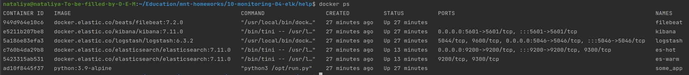
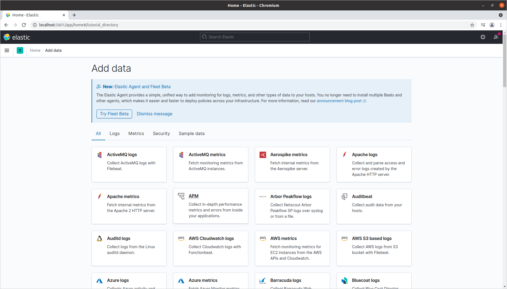
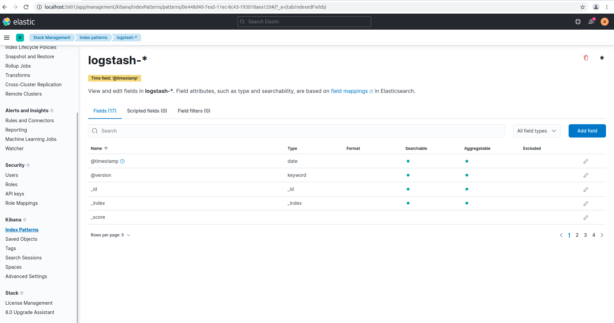
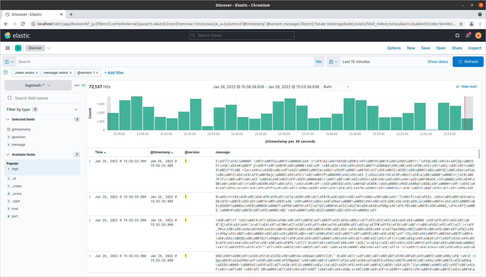

### 10.4. ELK - Наталия Проворкова
#### 1. Вам необходимо поднять в докере elasticsearch(hot и warm ноды)/logstash/kibana/filebeat


#### 2. Перейдите в меню создания index-patterns в kibana и создайте несколько index-patterns из имеющихся. Перейдите в меню просмотра логов в kibana (Discover) и самостоятельно изучите как отображаются логи и как производить поиск по логам.
Быстро выполнить задание с помощью директории help не вышло, не получилось и довести ее до рабочего состояния. Для выполнения работы использовался найденный рабочий docker-compose.yml.
```
sudo sysctl -w vm.max_map_count=262144
sudo systemctl restart docker
sudo chown root ./filebeat/config/filebeat.yml
sudo chmod go-w ./filebeat/config/filebeat.yml
```

