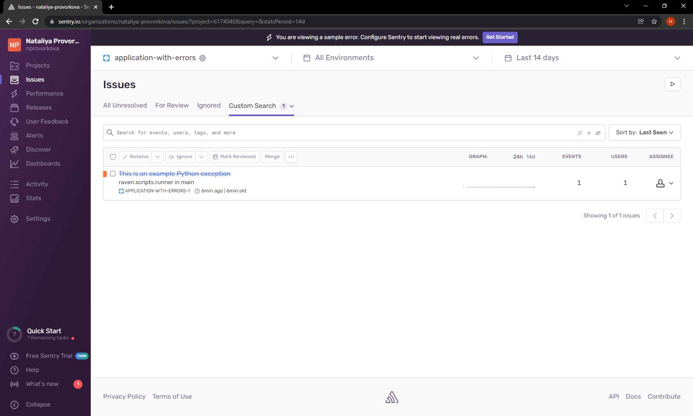

### 10.5. Sentry - Наталия Проворкова
#### 1.Так как self-hosted Sentry довольно требовательная к ресурсам система, мы будем использовать Free cloud аккаунт. Free cloud account имеет следующие ограничения: 5 000 errors, 10 000 transactions, 1 GB attachments. Для подключения Free cloud account: зайдите на sentry.io, нажмите "Try for free", используйте авторизацию через ваш github-account, далее следуйте инструкциям. Для выполнения задания - пришлите скриншот меню Projects.

#### 2. Создайте python проект и нажмите Generate sample event для генерации тестового события. Изучите информацию, представленную в событии. Перейдите в список событий проекта, выберите созданное вами и нажмите Resolved. Для выполнения задание предоставьте скриншот Stack trace из этого события и список событий проекта, после нажатия Resolved.

<br>
#### 3. Перейдите в создание правил алёртинга. Выберите проект и создайте дефолтное правило алёртинга, без настройки полей. Снова сгенерируйте событие Generate sample event. Если всё было выполнено правильно - через некоторое время, вам на почту, привязанную к github аккаунту придёт оповещение о произошедшем событии. Если сообщение не пришло - проверьте настройки аккаунта Sentry (например привязанную почту), что у вас не было sample issue до того как вы его сгенерировали и то, что правило алёртинга выставлено по дефолту (во всех полях all). Также проверьте проект в котором вы создаёте событие, возможно алёрт привязан к другому. Для выполнения задания - пришлите скриншот тела сообщения из оповещения на почте. Дополнительно поэкспериментируйте с правилами алёртинга. Выбирайте разные условия отправки и создавайте sample events.

#### 4. Создайте проект на ЯП python или GO (небольшой, буквально 10-20 строк), подключите к нему sentry SDK и отправьте несколько тестовых событий. Поэкспериментируйте с различными передаваемыми параметрами, но помните об ограничениях free учетной записи cloud Sentry. Для выполнения задания пришлите скриншот меню issues вашего проекта и пример кода подключения sentry sdk/отсылки событий.

```
#!/usr/bin/env python3

import sentry_sdk

sentry_sdk.init(
    "https://e29eb4e5f88b4f3ba1f6a4a4fcad44d3@o1130092.ingest.sentry.io/6174040",

    # Set traces_sample_rate to 1.0 to capture 100%
    # of transactions for performance monitoring.
    # We recommend adjusting this value in production.
    traces_sample_rate=1.0
)

sum = 2 + '1'
```