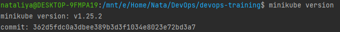
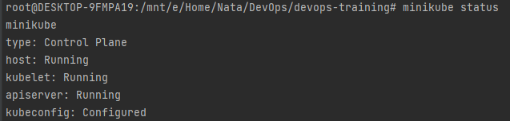
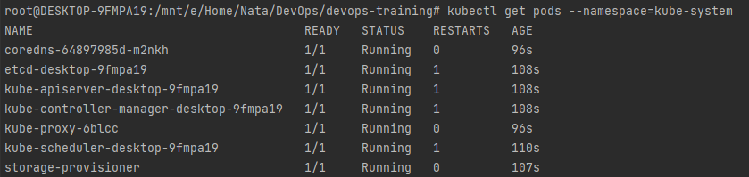
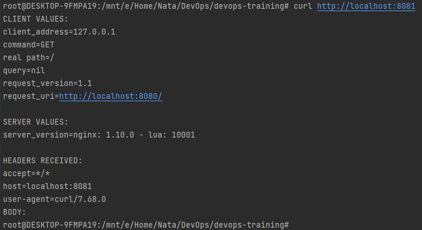
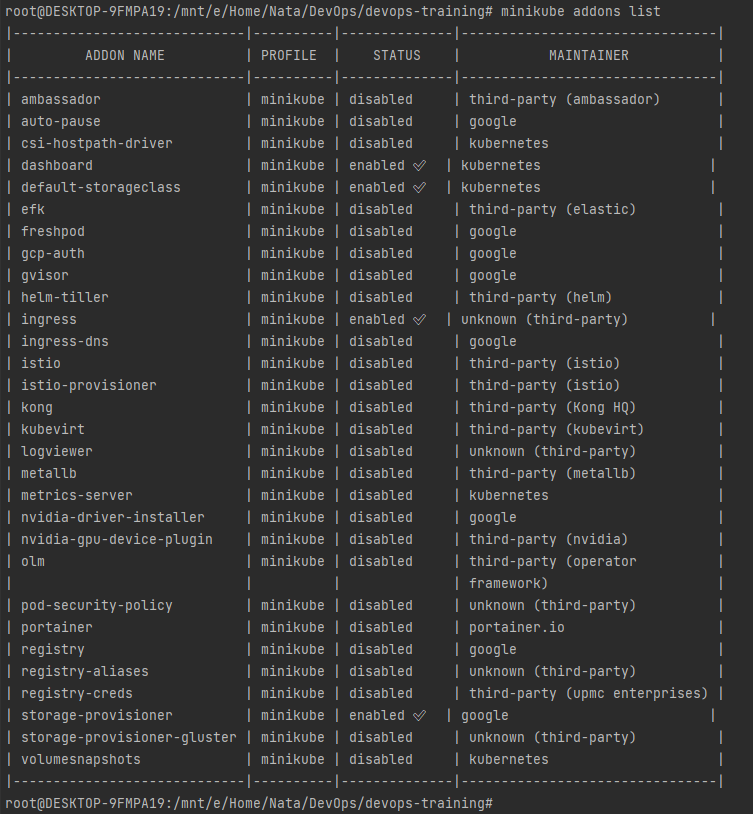
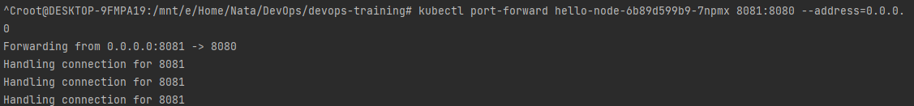
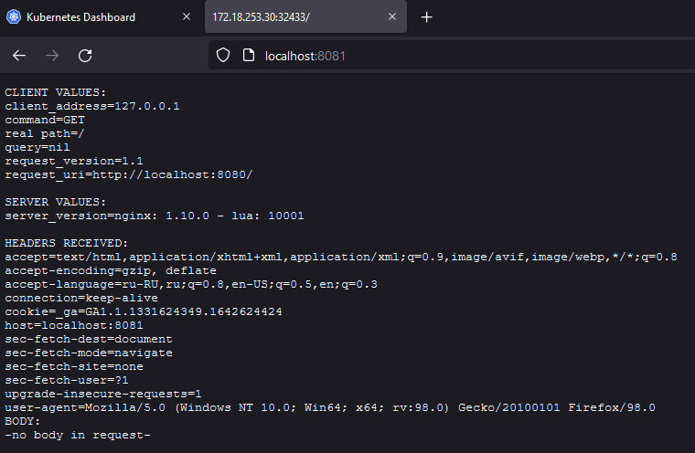

### 12.1 Компоненты Kubernetes - Наталия Проворкова
#### 1. Установить Minikube
```
Для экспериментов и валидации ваших решений вам нужно подготовить тестовую среду для работы с Kubernetes. Оптимальное решение — развернуть на рабочей машине Minikube.

Как поставить на AWS:
создать EC2 виртуальную машину (Ubuntu Server 20.04 LTS (HVM), SSD Volume Type) с типом t3.small. Для работы потребуется настроить Security Group для доступа по ssh. Не забудьте указать keypair, он потребуется для подключения.
подключитесь к серверу по ssh (ssh ubuntu@<ipv4_public_ip> -i .pem)
установите миникуб и докер следующими командами:
curl -LO https://storage.googleapis.com/kubernetes-release/release/`curl -s https://storage.googleapis.com/kubernetes-release/release/stable.txt`/bin/linux/amd64/kubectl
chmod +x ./kubectl
sudo mv ./kubectl /usr/local/bin/kubectl
sudo apt-get update && sudo apt-get install docker.io conntrack -y
curl -Lo minikube https://storage.googleapis.com/minikube/releases/latest/minikube-linux-amd64 && chmod +x minikube && sudo mv minikube /usr/local/bin/
проверить версию можно командой minikube version
переключаемся на root и запускаем миникуб: minikube start --vm-driver=none
после запуска стоит проверить статус: minikube status
запущенные служебные компоненты можно увидеть командой: kubectl get pods --namespace=kube-system
Для сброса кластера стоит удалить кластер и создать заново:
minikube delete
sudo rm -rf /tmp/juju-mk*
sudo rm -rf /tmp/minikube.*
minikube start --vm-driver=none
Возможно, для повторного запуска потребуется выполнить команду: sudo sysctl fs.protected_regular=0

Инструкция по установке Minikube - ссылка

Важно: t3.small не входит во free tier, следите за бюджетом аккаунта и удаляйте виртуалку.
```

<br>
<br>

#### 2. Запуск Hello World
```
После установки Minikube требуется его проверить. Для этого подойдет стандартное приложение hello world. А для доступа к нему потребуется ingress.

развернуть через Minikube тестовое приложение по туториалу https://kubernetes.io/ru/docs/tutorials/hello-minikube/#%D1%81%D0%BE%D0%B7%D0%B4%D0%B0%D0%BD%D0%B8%D0%B5-%D0%BA%D0%BB%D0%B0%D1%81%D1%82%D0%B5%D1%80%D0%B0-minikube
установить аддоны ingress и dashboard
```
kubectl expose deployment hello-node --type=ClusterIP --port=8080
<br>kubectl port-forward hello-node-6b89d599b9-7npmx 8081:8080 --address=0.0.0.0
<br>curl http://localhost:8081
<br>
<br>minikube addons enable ingress
<br>minikube addons enable dashboard
<br>

#### 3. Установить kubectl
```
Подготовить рабочую машину для управления корпоративным кластером. Установить клиентское приложение kubectl.

подключиться к minikube
проверить работу приложения из задания 2, запустив port-forward до кластера
```

<br>