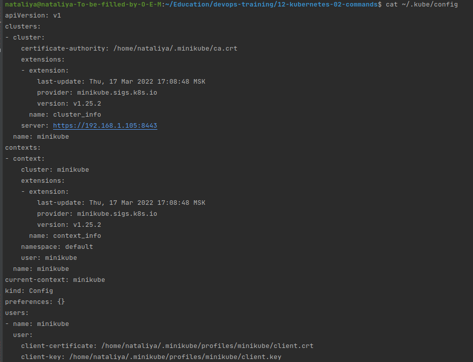
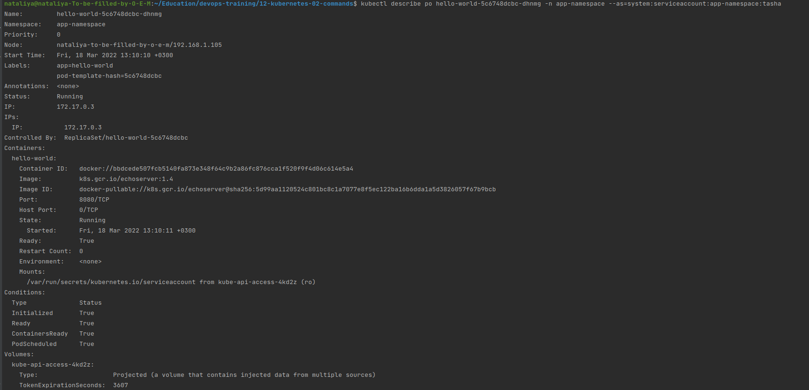

### 12.2 Команды для работы с Kubernetes - Наталия Проворкова
#### 1. Запуск пода из образа в деплойменте
```
Для начала следует разобраться с прямым запуском приложений из консоли. Такой подход поможет быстро развернуть инструменты отладки в кластере. Требуется запустить деплоймент на основе образа из hello world уже через deployment. Сразу стоит запустить 2 копии приложения (replicas=2).

Требования:

пример из hello world запущен в качестве deployment
количество реплик в deployment установлено в 2
наличие deployment можно проверить командой kubectl get deployment
наличие подов можно проверить командой kubectl get pods
```
[deployment](yamls/deployment.yml)
<br>kubectl create namespace app-namespace
<br>kubectl apply -f deployment.yaml
<br>kubectl get deploy -n app-namespace
<br>kubectl get po -n app-namespace
<br>

#### 2. Просмотр логов для разработки
```
Разработчикам крайне важно получать обратную связь от штатно работающего приложения и, еще важнее, об ошибках в его работе. Требуется создать пользователя и выдать ему доступ на чтение конфигурации и логов подов в app-namespace.

Требования:

создан новый токен доступа для пользователя
пользователь прописан в локальный конфиг (~/.kube/config, блок users)
пользователь может просматривать логи подов и их конфигурацию (kubectl logs pod <pod_id>, kubectl describe pod <pod_id>)
```
[serviceaccount](yamls/serviceaccount.yml)
<br>[role](yamls/role.yml)
<br>[rolebinding](yamls/rolebinding.yml)
<br>kubectl apply -f serviceaccount.yaml -n app-namespace
<br>kubectl apply -f role.yaml -n app-namespace
<br>kubectl apply -f rolebinding.yaml -n app-namespace
<br>kubectl get secret
<br>
<br>cat ~/.kube/config
<br>
~~<br>export TOKENNAME=$(kubectl -n app-namespace get serviceaccount/tasha -o jsonpath='{.secrets[0].name}')~~
~~<br>export TOKEN=$(kubectl -n app-namespace get secret $TOKENNAME -o jsonpath='{.data.token}' | base64 --decode)~~
~~<br>kubectl config set-credentials tasha --token=$TOKEN~~
~~<br>kubectl config set-context --current --user=tasha~~
<br>kubectl get po -n app-namespace --as=system:serviceaccount:app-namespace:tasha
<br>kubectl logs hello-world-5c6748dcbc-dhnmg -n app-namespace --as=system:serviceaccount:app-namespace:tasha
<br>
<br>kubectl describe po hello-world-5c6748dcbc-dhnmg -n app-namespace --as=system:serviceaccount:app-namespace:tasha
<br>
<br>
<br>kubectl delete po hello-world-5c6748dcbc-dhnmg -n app-namespace --as=system:serviceaccount:app-namespace:tasha
<br>kubectl get deploy -n app-namespace --as=system:serviceaccount:app-namespace:tasha
<br>kubectl get po --as=system:serviceaccount:app-namespace:tasha
<br>

#### 3. Изменение количества реплик
```
Поработав с приложением, вы получили запрос на увеличение количества реплик приложения для нагрузки. Необходимо изменить запущенный deployment, увеличив количество реплик до 5. Посмотрите статус запущенных подов после увеличения реплик.

Требования:

в deployment из задания 1 изменено количество реплик на 5
проверить что все поды перешли в статус running (kubectl get pods)
```
kubectl scale --replicas=5 deploy hello-world -n app-namespace
<br>
<br>
<br>