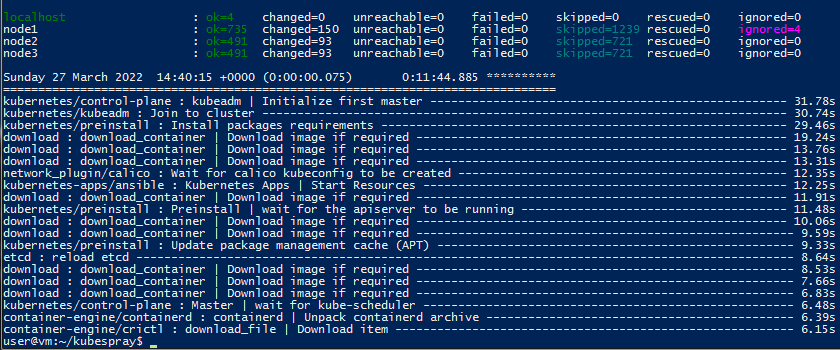
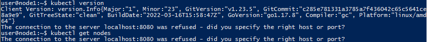
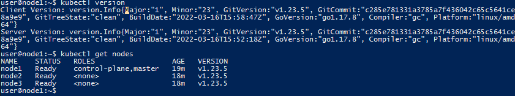

### 12.4 Развертывание кластера на собственных серверах, лекция 2 - Наталия Проворкова
#### 1. Подготовить инвентарь kubespray
```
Новые тестовые кластеры требуют типичных простых настроек. Нужно подготовить инвентарь и проверить его работу. Требования к инвентарю:

подготовка работы кластера из 5 нод: 1 мастер и 4 рабочие ноды;
в качестве CRI — containerd;
запуск etcd производить на мастере.
```
Так как под рукой нет ресурсов для запуска вагранта, приняла решение поднять виртуалку с Ubuntu в облаке, на ней запускать KubeSpray и развернуть кластер: 1 Control Plane и 2 Worker-nodes.
<br>ssh  user@51.250.102.171 - адрес вспомогательной ВМ
<br>sudo apt-get update 
<br>sudo apt-get install git
<br>git clone https://github.com/kubernetes-sigs/kubespray
<br>sudo apt-get -y install python3-pip
<br>cd kubespray
<br>sudo pip3 install -r requirements.txt
<br>whoami
<br>ssh-keygen
<br>cat ~/.ssh/id_rsa.pub
<br>cp -rfp inventory/sample inventory/happy-cluster
<br>cd inventory/happy-cluster
<br><br>ssh 51.250.99.127 -cp
<br>ssh 51.250.99.45 - worker1
<br>ssh 51.250.99.147 -worker2
<br>[inventory.ini](inventory/happy-cluster/inventry.ini)
<br>В k8s-cluster.yml устанавливаем 
```
container_manager: containerd
```
В containerd.yml
```
containerd_registries:
  "docker.io":
    - "https://hub.docker.com"
    - "https://k8s.gcr.io"
```
В all.yml
```
loadbalancer_apiserver:
  address: 51.250.99.127
  port: 6443
```
/roles/kubernetes/node/tasks/main.yml
```
Change all occurrence of “nf_conntrack_ipv4” To “nf_conntrack”
```
<br>ansible-playbook -i inventory/happy-cluster/inventory.ini cluster.yml -b -v -e ansible_user=user
<br>
<br>Заходим на мастер-ноду
<br>kubectl get nodes
<br>
<br>Получение списка нод выдает ошибку (это связано с отсутствием каталога .kube с правильной конфигурацией), нашла решение:
```
  mkdir -p $HOME/.kube
  sudo cp -i /etc/kubernetes/admin.conf $HOME/.kube/config
  sudo chown $(id -u):$(id -g) $HOME/.kube/config
```

