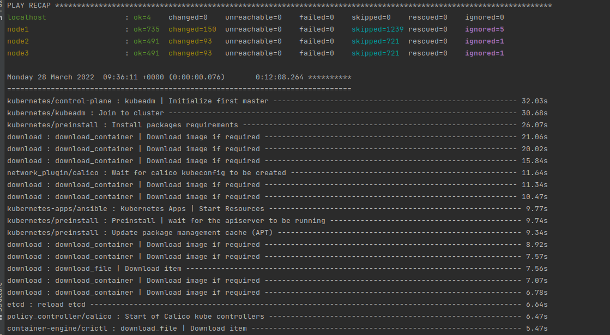
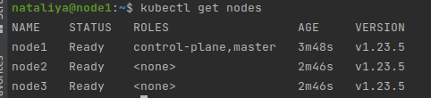
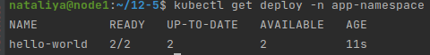
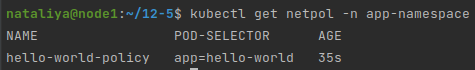
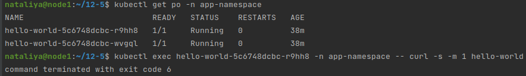
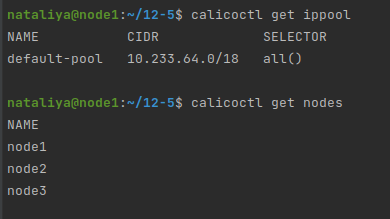
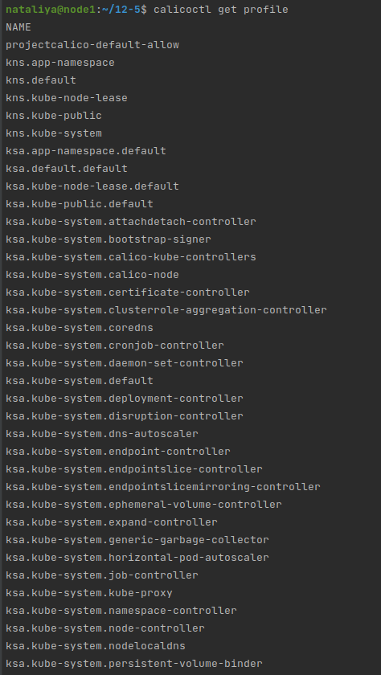
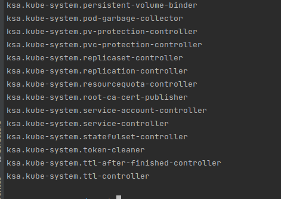

### 12.5 Сетевые решения CNI - Наталия Проворкова
#### 1. Установить в кластер CNI плагин Calico
```
Для проверки других сетевых решений стоит поставить отличный от Flannel плагин — например, Calico. Требования:

установка производится через ansible/kubespray;
после применения следует настроить политику доступа к hello-world извне. Инструкции kubernetes.io https://github.com/netology-code/devkub-homeworks/blob/main/12-kubernetes-05-cni.md#:~:text=%D0%94%D0%BB%D1%8F%20%D0%BF%D1%80%D0%BE%D0%B2%D0%B5%D1%80%D0%BA%D0%B8%20%D0%B4%D1%80%D1%83%D0%B3%D0%B8%D1%85,kubernetes.io%2C%20Calico, Calico https://docs.projectcalico.org/about/about-network-policy
```
Разворачиваем кластер с Calico
<br>
<br>
<br>Воспользуемся деплойментом из задания 12.2
<br>[deployment](deployment.yaml)
<br>kubectl create namespace app-namespace
<br>kubectl apply -f deployment.yaml
<br>kubectl get deploy -n app-namespace
<br>
<br>Создадим политику, разрешающую входящий трафик к подам hello-world
<br>[networkpolicy](networkpolicy.yaml)
<br>kubectl apply -f networkpolicy.yaml
<br>
<br>Проверяем, что поды между собой общаться не могут
<br>
<br>Не разобралась, как проверить доступ к поду снаружи
#### 2. Изучить, что запущено по умолчанию
```
Самый простой способ — проверить командой calicoctl get . Для проверки стоит получить список нод, ipPool и profile. Требования:

установить утилиту calicoctl;
получить 3 вышеописанных типа в консоли.
```

<br>
<br>