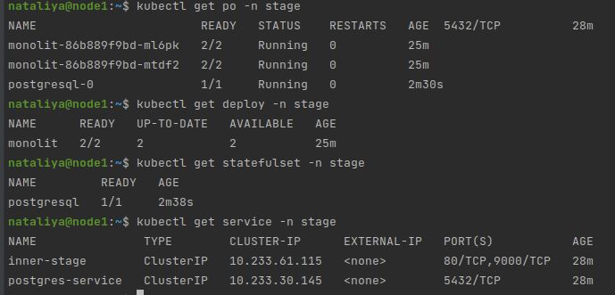
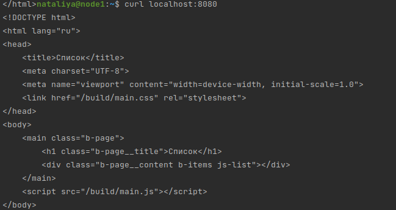

### 13.1 Контейнеры, поды, deployment, statefulset, services, endpoints - Наталия Проворкова
#### 1. Подготовить тестовый конфиг для запуска приложения
```
Для начала следует подготовить запуск приложения в stage окружении с простыми настройками. Требования:

под содержит в себе 2 контейнера — фронтенд, бекенд;
регулируется с помощью deployment фронтенд и бекенд;
база данных — через statefulset.
https://github.com/netology-code/devkub-homeworks/tree/main/13-kubernetes-config
```
Собираем проект локально и пушим образ на dockerhub
<br>docker-compose up --build
<br>docker images
<br>docker login
<br>docker tag 13-kubernetes-config_frontend:latest provorkova/kubernetes-config_frontend:latest
<br>docker tag 13-kubernetes-config_backend:latest provorkova/kubernetes-config_backend:latest
<br>docker push provorkova/kubernetes-config_frontend:latest
<br>docker push provorkova/kubernetes-config_backend:latest
<br><br>Создаем [deployment](stage/deployment.yaml), [statefulset](stage/statefulset.yaml) и [services](stage/services.yaml) для stage
<br>kubectl create namespace stage
<br>kubectl apply -f stage
<br>
<br>kubectl port-forward -n stage service/inner-stage 8080:80 
<br>
#### 2. Подготовить конфиг для production окружения
```
Следующим шагом будет запуск приложения в production окружении. Требования сложнее:

каждый компонент (база, бекенд, фронтенд) запускаются в своем поде, регулируются отдельными deployment’ами;
для связи используются service (у каждого компонента свой);
в окружении фронта прописан адрес сервиса бекенда;
в окружении бекенда прописан адрес сервиса базы данных.
```
