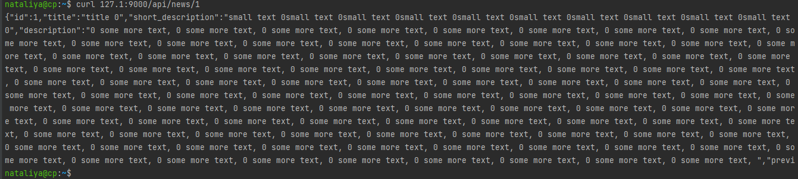
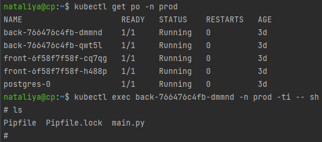
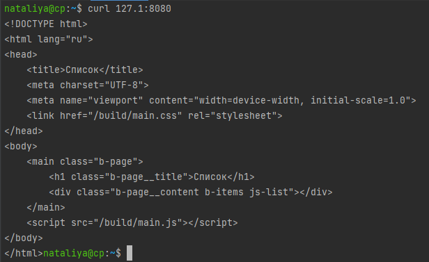
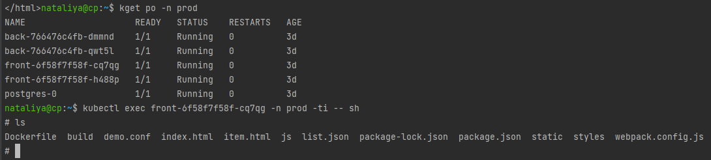
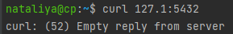
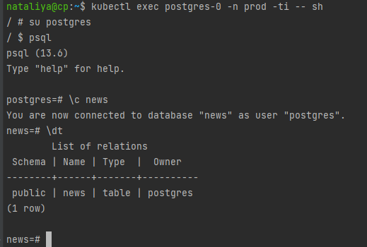
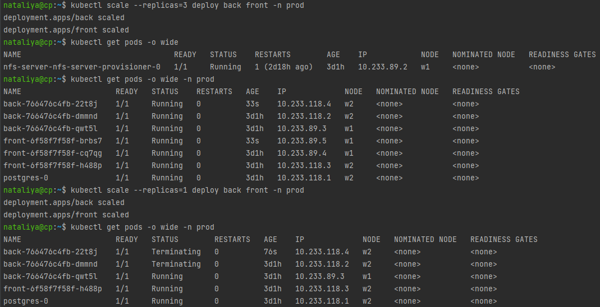
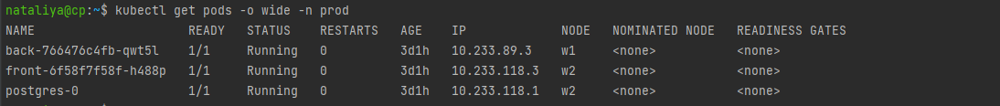

### 13.3 Работа с kubectl - Наталия Проворкова
#### 1. Проверить работоспособность каждого компонента
```
Для проверки работы можно использовать 2 способа: port-forward и exec. Используя оба способа, проверьте каждый компонент:

сделайте запросы к бекенду;
сделайте запросы к фронту;
подключитесь к базе данных.
```
kubectl port-forward -n prod service/back-service 9000:9000 
<br>
<br>kubectl get po -n prod
<br>kubectl exec back-766476c4fb-dmmnd -n prod -ti -- sh
<br>
<br><br>kubectl port-forward -n prod service/front-service 8080:8000 
<br>
<br>kubectl get po -n prod
<br>kubectl exec front-6f58f7f58f-cq7qg -n prod -ti -- sh
<br>
<br><br>kubectl port-forward -n prod service/postgres-service 5432:5432
<br>
<br>kubectl get po -n prod
<br>kubectl exec postgres-0 -n prod -ti -- sh
<br>
#### 2. Ручное масштабирование
```
При работе с приложением иногда может потребоваться вручную добавить пару копий. Используя команду kubectl scale, попробуйте увеличить количество бекенда и фронта до 3. Проверьте, на каких нодах оказались копии после каждого действия (kubectl describe, kubectl get pods -o wide). После уменьшите количество копий до 1.
```
kubectl scale --replicas=3 deploy back front -n prod
<br>kubectl get pods -o wide -n prod
<br>
<br>