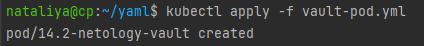
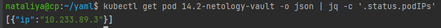
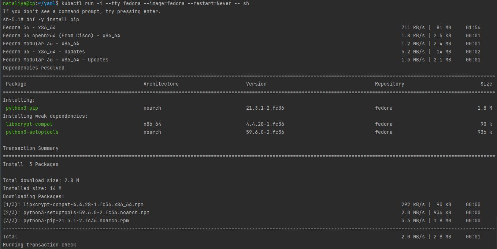
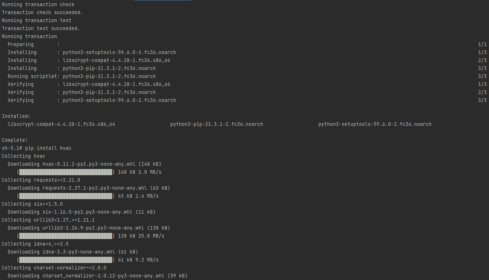
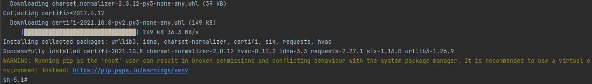
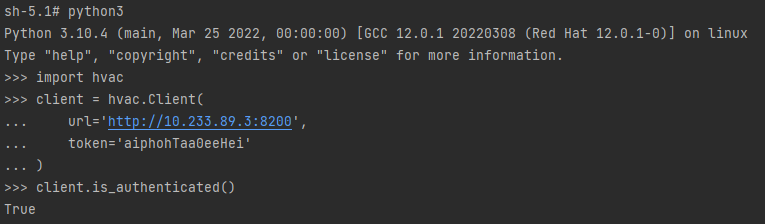
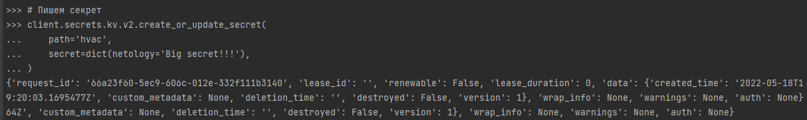
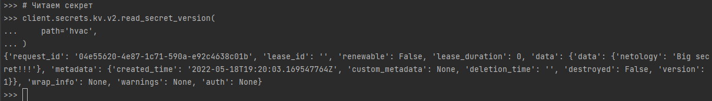

### 14.2 Синхронизация секретов с внешними сервисами. Vault - Наталия Проворкова
#### 1. Работа с модулем Vault
```
Запустить модуль Vault конфигураций через утилиту kubectl в установленном minikube
kubectl apply -f vault-pod.yml
```

```
Получить значение внутреннего IP пода
kubectl get pod 14.2-netology-vault -o json | jq -c '.status.podIPs'
Примечание: jq - утилита для работы с JSON в командной строке
```

```
Запустить второй модуль для использования в качестве клиента
kubectl run -i --tty fedora --image=fedora --restart=Never -- sh
Установить дополнительные пакеты
dnf -y install pip
pip install hvac
```



```
Запустить интепретатор Python и выполнить следующий код, предварительно поменяв IP и токен

import hvac
client = hvac.Client(
    url='http://10.233.89.3:8200',
    token='aiphohTaa0eeHei'
)
client.is_authenticated()
```

```
# Пишем секрет
client.secrets.kv.v2.create_or_update_secret(
    path='hvac',
    secret=dict(netology='Big secret!!!'),
)
```

```
# Читаем секрет
client.secrets.kv.v2.read_secret_version(
    path='hvac',
)
```


