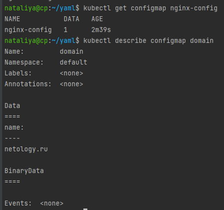

### 14.3 Карты конфигураций - Наталия Проворкова
#### 1. Работа с картами конфигураций через утилиту kubectl в установленном minikube
```
Как создать карту конфигураций?
kubectl create configmap nginx-config --from-file=nginx.conf
kubectl create configmap domain --from-literal=name=netology.ru
```

```
Как просмотреть список карт конфигураций?
kubectl get configmaps
kubectl get configmap
```

```
Как просмотреть карту конфигурации?
kubectl get configmap nginx-config
kubectl describe configmap domain
```

```
Как получить информацию в формате YAML и/или JSON?
kubectl get configmap nginx-config -o yaml
kubectl get configmap domain -o json
```

```
Как выгрузить карту конфигурации и сохранить его в файл?
kubectl get configmaps -o json > configmaps.json
kubectl get configmap nginx-config -o yaml > nginx-config.yml
```

  
```
Как удалить карту конфигурации?
kubectl delete configmap nginx-config
```
 
```
Как загрузить карту конфигурации из файла?
kubectl apply -f nginx-config.yml
```
 