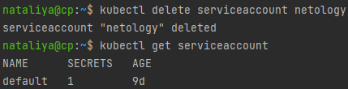

### 14.4 Сервис-аккаунты - Наталия Проворкова
#### 1. Работа с сервис-аккаунтами через утилиту kubectl в установленном minikube
```
Как создать сервис-аккаунт?
kubectl create serviceaccount netology
```

```
Как просмотреть список сервис-акаунтов?
kubectl get serviceaccounts
kubectl get serviceaccount
```

```
Как получить информацию в формате YAML и/или JSON?
kubectl get serviceaccount netology -o yaml
kubectl get serviceaccount default -o json
```

```
Как выгрузить сервис-акаунты и сохранить его в файл?
kubectl get serviceaccounts -o json > serviceaccounts.json
kubectl get serviceaccount netology -o yaml > netology.yml
```

  
```
Как удалить сервис-акаунт?
kubectl delete serviceaccount netology
```
 
```
Как загрузить сервис-акаунт из файла?
kubectl apply -f netology.yml
```
 
#### 2.(*) Работа с сервис-акаунтами внутри модуля
```
Выбрать любимый образ контейнера, подключить сервис-акаунты и проверить доступность API Kubernetes
kubectl run -n test-serviceaccount -i --tty fedora --image=fedora --restart=Never -- sh
```
 
```
Просмотреть переменные среды
env | grep KUBE
```

```
Получить значения переменных
K8S=https://$KUBERNETES_SERVICE_HOST:$KUBERNETES_SERVICE_PORT
SADIR=/var/run/secrets/kubernetes.io/serviceaccount
TOKEN=$(cat $SADIR/token)
CACERT=$SADIR/ca.crt
NAMESPACE=$(cat $SADIR/namespace)
```

```
Подключаемся к API
curl -H "Authorization: Bearer $TOKEN" --cacert $CACERT $K8S/api/v1/
```

```
Подключаемся к API
curl -H "Authorization: Bearer $TOKEN" --cacert $CACERT $K8S/api/v1/
```


