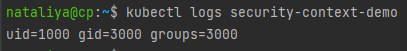

### 14.5 SecurityContext, NetworkPolicies - Наталия Проворкова
#### 1. Рассмотрите пример 14.5/example-security-context.yml
```
Создайте модуль
kubectl apply -f 14.5/example-security-context.yml
```

```
Проверьте установленные настройки внутри контейнера
kubectl logs security-context-demo
uid=1000 gid=3000 groups=3000
```

#### 2.(*) Рассмотрите пример 14.5/example-network-policy.yml
```
Создайте два модуля. Для первого модуля разрешите доступ к внешнему миру и ко второму контейнеру. Для второго модуля разрешите связь только с первым контейнером. Проверьте корректность настроек.
```
kubectl create namespace app-namespace
<br>kubectl apply -f first-deployment.yaml
```yaml
---
apiVersion: apps/v1
kind: Deployment
metadata:
  name: first-hello-world
  namespace: app-namespace
spec:
  replicas: 2
  selector:
    matchLabels:
      app: first-hello-world
  template:
    metadata:
      labels:
        app: first-hello-world
    spec:
      containers:
      - image: k8s.gcr.io/echoserver:1.4
        name: hello-world
        ports:
        - containerPort: 8080
```
kubectl apply -f second-deployment.yaml
```yaml
---
apiVersion: apps/v1
kind: Deployment
metadata:
  name: second-hello-world
  namespace: app-namespace
spec:
  replicas: 2
  selector:
    matchLabels:
      app: second-hello-world
  template:
    metadata:
      labels:
        app: second-hello-world
    spec:
      containers:
      - image: k8s.gcr.io/echoserver:1.4
        name: hello-world
        ports:
        - containerPort: 8080
```
kubectl apply -f first-networkpolicy.yaml
```yaml
---
apiVersion: networking.k8s.io/v1
kind: NetworkPolicy
metadata:
  name: first-hello-world-policy
  namespace: app-namespace
spec:
  podSelector:
    matchLabels:
      app: first-hello-world
  ingress:
  - from:
    - podSelector:
        matchLabels:
          app: second-hello-world
  egress:
  - {}
  policyTypes:
  - Ingress
  - Egress
```
kubectl apply -f second-networkpolicy.yaml
```yaml
---
apiVersion: networking.k8s.io/v1
kind: NetworkPolicy
metadata:
  name: second-hello-world-policy
  namespace: app-namespace
spec:
  podSelector:
    matchLabels:
      app: second-hello-world
  ingress:
  - from:
    - podSelector:
        matchLabels:
          app: first-hello-world
  egress:
  - to:
    - podSelector:
        matchLabels:
          app: first-hello-world
  policyTypes:
  - Ingress
  - Egress
```
kubectl apply -f services.yaml

```yaml
---
apiVersion: v1
kind: Service
metadata:
  name: first-service
  namespace: app-namespace
spec:
  type: ClusterIP
  selector:
    app: first-hello-world
  ports:
    - port: 80
      targetPort: 8080
      protocol: TCP
---
apiVersion: v1
kind: Service
metadata:
  name: second-service
  namespace: app-namespace
spec:
  ports:
    - port: 80
      targetPort: 8080
      protocol: TCP
  selector:
    app: second-hello-world
  type: ClusterIP
```
<br>kubectl get po -n app-namespace
<br>*Исходящий доступ от first:*
<br>kubectl exec first-hello-world-5bbd4b7c6b-mt7qj -n app-namespace -- curl -sL -o /dev/null -D - https://www.google.com
<br>*Отсутствует исходящий доступ от second:*
<br>kubectl exec second-hello-world-758557f5b4-xmt9c -n app-namespace -- curl -sL -o /dev/null -D - https://www.google.com
 
<br>kubectl get po -n app-namespace
<br>*Доступ от first к second:*
<br>kubectl exec first-hello-world-5bbd4b7c6b-mt7qj -n app-namespace -- curl -s -m 1 second-service
<br>*Отсутствует доступ от second к first:*
<br>kubectl exec second-hello-world-758557f5b4-gp5kx -n app-namespace -- curl -s -m 1 first-service
 

