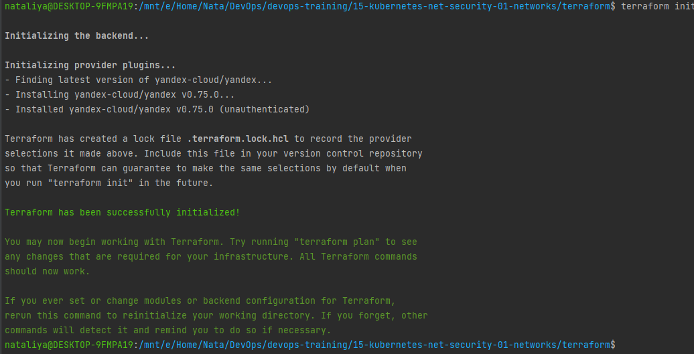
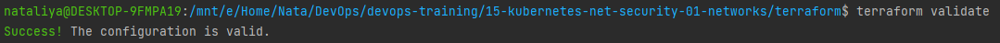
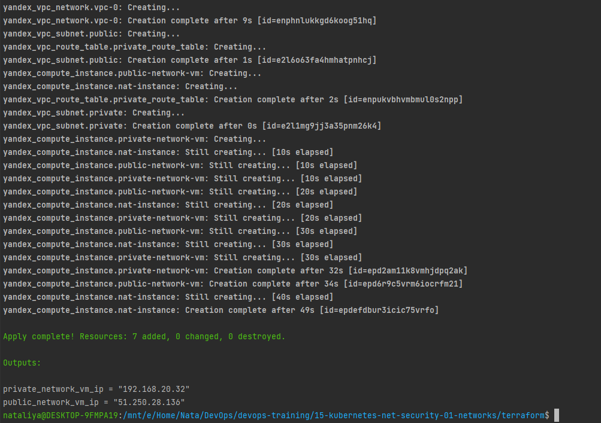
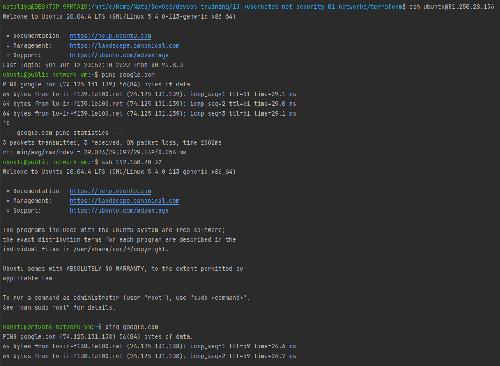

### 15.1. Организация сети - Наталия Проворкова
#### 1. Яндекс.Облако
###### 1. Создать VPC
*Создать пустую VPC. Выбрать зону*
```tf
terraform {
  required_version = ">= 1.0.0"

  required_providers {
    yandex = {
      source = "yandex-cloud/yandex"
    }
  }
}

provider "yandex" {
  cloud_id  = "b1g3s8lnqjnl4svbgr1b"
  folder_id = "b1gg1276n3b2qlltke1k"
  zone      = local.zone
}

locals {
  zone           = "ru-central1-b"
  public_subnet  = "192.168.10.0/24"
  private_subnet = "192.168.20.0/24"
  nat_image_id   = "fd80mrhj8fl2oe87o4e1"
  nat_gateway    = "192.168.10.254"
}
```
```tf
resource "yandex_vpc_network" "vpc-0" {
  name = "vpc-netology"
}
```
###### 2. Публичная подсеть
* *Создать в vpc subnet с названием public, сетью 192.168.10.0/24.*
* *Создать в этой подсети NAT-инстанс, присвоив ему адрес 192.168.10.254. В качестве image_id использовать fd80mrhj8fl2oe87o4e1*
* *Создать в этой публичной подсети виртуалку с публичным IP и подключиться к ней, убедиться что есть доступ к интернету.*
```tf
resource "yandex_vpc_subnet" "public" {
  zone           = local.zone
  network_id     = yandex_vpc_network.vpc-0.id
  v4_cidr_blocks = [local.public_subnet]
}
```
```tf
resource "yandex_compute_instance" "nat-instance" {
  name     = "nat-instance"
  hostname = "nat-instance"

  resources {
    cores  = 2
    memory = 2
  }

  boot_disk {
    initialize_params {
      image_id = local.nat_image_id
    }
  }

  network_interface {
    subnet_id  = yandex_vpc_subnet.public.id
    ip_address = local.nat_gateway
    nat        = true
  }

  scheduling_policy {
    preemptible = true
  }

  metadata = {
    ssh-keys = "cloud-user:${file("~/.ssh/id_rsa.pub")}"
  }
}
```
```tf
data "yandex_compute_image" "ubuntu-2004" {
  family = "ubuntu-2004-lts"
}

resource "yandex_compute_instance" "public-network-vm" {
  name     = "public-network-vm"
  hostname = "public-network-vm"

  resources {
    cores  = 2
    memory = 2
  }

  boot_disk {
    initialize_params {
      image_id = data.yandex_compute_image.ubuntu-2004.id
    }
  }

  network_interface {
    subnet_id = yandex_vpc_subnet.public.id
    nat       = true
  }

  scheduling_policy {
    preemptible = true
  }

  metadata = {
    ssh-keys = "cloud-user:${file("~/.ssh/id_rsa.pub")}"
  }
}
```
###### 3. Приватная подсеть
* *Создать в vpc subnet с названием private, сетью 192.168.20.0/24.*
* *Создать route table. Добавить статический маршрут, направляющий весь исходящий трафик private сети в NAT-инстанс*
* *Создать в этой приватной подсети виртуалку с внутренним IP, подключиться к ней через виртуалку, созданную ранее и убедиться что есть доступ к интернету*
```tf
resource "yandex_vpc_subnet" "private" {
  zone           = local.zone
  network_id     = yandex_vpc_network.vpc-0.id
  v4_cidr_blocks = [local.private_subnet]
  route_table_id = yandex_vpc_route_table.private_route_table.id
}
```
```tf
resource "yandex_vpc_route_table" "private_route_table" {
  network_id = yandex_vpc_network.vpc-0.id

  static_route {
    destination_prefix = "0.0.0.0/0"
    next_hop_address   = local.nat_gateway
  }
}
```
```tf
resource "yandex_compute_instance" "private-network-vm" {
  name     = "private-network-vm"
  hostname = "private-network-vm"

  resources {
    cores  = 2
    memory = 2
  }

  boot_disk {
    initialize_params {
      image_id = data.yandex_compute_image.ubuntu-2004.id
    }
  }

  network_interface {
    subnet_id = yandex_vpc_subnet.private.id
    nat       = false
  }

  scheduling_policy {
    preemptible = true
  }

  metadata = {
    ssh-keys = "cloud-user:${file("~/.ssh/id_rsa.pub")}"
  }
}
```
export YC_TOKEN="***"
<br>Добавляем в nano ~/.terraformrc
```tf
provider_installation {
  network_mirror {
    url = "https://terraform-mirror.yandexcloud.net/"
    include = ["registry.terraform.io/*/*"]
  }
  direct {
    exclude = ["registry.terraform.io/*/*"]
  }
}
```
terraform init
<br>
<br>terraform validate
<br>
<br>terraform fmt
<br>terraform plan
<br>terraform apply
<br>
<br>Пришлось скопировать приватный ключ на public-network-vm, чтобы зайти на private-network-vm
<br>