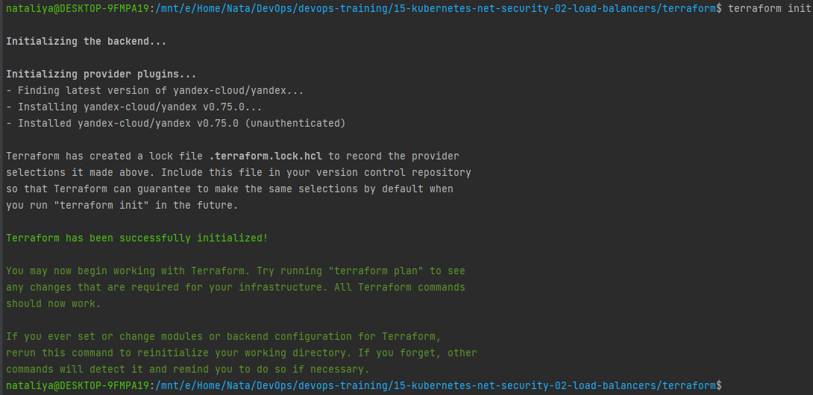
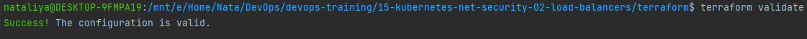
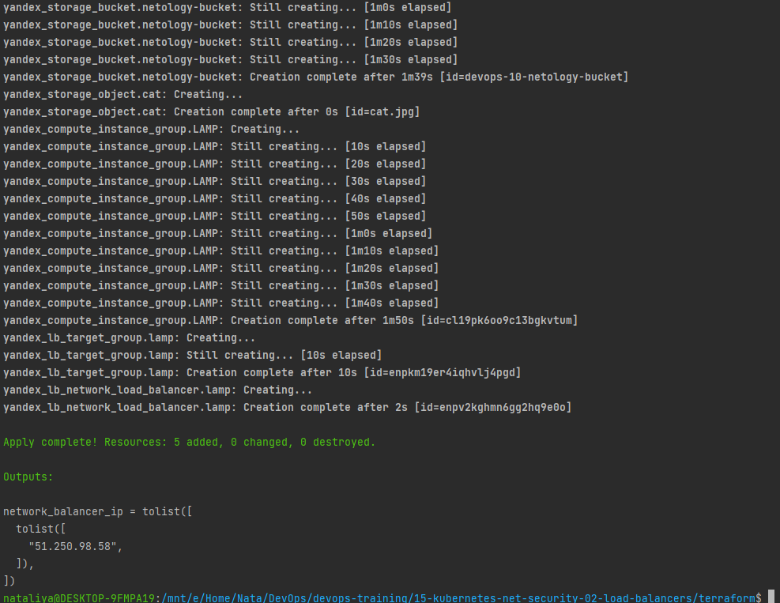
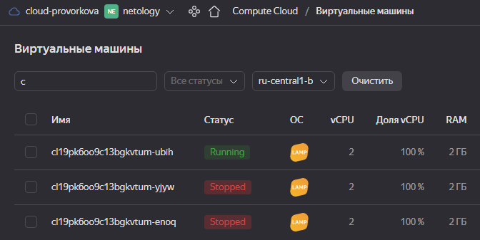

### 15.2. Вычислительные мощности. Балансировщики нагрузки - Наталия Проворкова
#### 1. Яндекс.Облако
###### 1. Создать bucket Object Storage и разместить там файл с картинкой
* *Создать bucket в Object Storage с произвольным именем (например, имя_студента_дата);*
* *Положить в bucket файл с картинкой;*
* *Сделать файл доступным из Интернет.*
```tf
terraform {
  required_version = ">= 1.0.0"

  required_providers {
    yandex = {
      source = "yandex-cloud/yandex"
    }
  }
}

provider "yandex" {
  cloud_id  = "b1g3s8lnqjnl4svbgr1b"
  folder_id = "b1gg1276n3b2qlltke1k"
  zone      = local.zone
}

locals {
  zone          = "ru-central1-b"
  public_subnet = "192.168.10.0/24"
  lamp_image_id = "fd827b91d99psvq5fjit"
}
```
```tf
resource "yandex_vpc_network" "vpc-0" {
  name = "vpc-netology"
}
```
```tf
resource "yandex_vpc_subnet" "public" {
  zone           = local.zone
  network_id     = yandex_vpc_network.vpc-0.id
  v4_cidr_blocks = [local.public_subnet]
}
```
```tf
resource "yandex_iam_service_account" "service-account-0" {
  name = "netology-service-account"
}

resource "yandex_resourcemanager_folder_iam_member" "sa-editor" {
  folder_id  = yandex_iam_service_account.service-account-0.folder_id
  role       = "editor"
  member     = "serviceAccount:${yandex_iam_service_account.service-account-0.id}"
  depends_on = [yandex_iam_service_account.service-account-0]
}

resource "yandex_iam_service_account_static_access_key" "sa-static-key" {
  service_account_id = yandex_iam_service_account.service-account-0.id
  description        = "static access key for object storage"
  depends_on         = [yandex_iam_service_account.service-account-0]
}
```
```tf
resource "yandex_storage_bucket" "netology-bucket" {
  access_key = yandex_iam_service_account_static_access_key.sa-static-key.access_key
  secret_key = yandex_iam_service_account_static_access_key.sa-static-key.secret_key
  depends_on = [yandex_iam_service_account_static_access_key.sa-static-key]
  bucket     = "devops-10-netology-bucket"
  acl        = "public-read"
}

resource "yandex_storage_object" "cat" {
  access_key   = yandex_iam_service_account_static_access_key.sa-static-key.access_key
  secret_key   = yandex_iam_service_account_static_access_key.sa-static-key.secret_key
  depends_on   = [yandex_iam_service_account_static_access_key.sa-static-key]
  bucket       = yandex_storage_bucket.netology-bucket.bucket
  key          = "cat.jpg"
  content_type = "image/jpeg"
  source       = "../imgs/cat.jpg"
  acl          = "public-read"
}
```
###### 2. Создать группу ВМ в public подсети фиксированного размера с шаблоном LAMP и web-страничкой, содержащей ссылку на картинку из bucket:
* *Создать Instance Group с 3 ВМ и шаблоном LAMP. Для LAMP рекомендуется использовать image_id = fd827b91d99psvq5fjit;*
* *Для создания стартовой веб-страницы рекомендуется использовать раздел user_data в meta_data; (https://cloud.yandex.ru/docs/compute/concepts/vm-metadata)*
* *Разместить в стартовой веб-странице шаблонной ВМ ссылку на картинку из bucket;*
* *Настроить проверку состояния ВМ.*
```tf
resource "yandex_compute_instance_group" "LAMP" {
  name               = "lamp"
  folder_id          = yandex_iam_service_account.service-account-0.folder_id
  service_account_id = yandex_iam_service_account.service-account-0.id
  depends_on         = [yandex_resourcemanager_folder_iam_member.sa-editor]

  instance_template {
    resources {
      memory = 2
      cores  = 2
    }

    boot_disk {
      mode = "READ_WRITE"
      initialize_params {
        image_id = local.lamp_image_id
      }
    }

    network_interface {
      subnet_ids = [yandex_vpc_subnet.public.id]
      nat        = true
    }

    metadata = {
      ssh-keys  = "ubuntu:${file("~/.ssh/id_rsa.pub")}"
      user-data = <<EOF
#!/bin/sh
PICURL="https://storage.yandexcloud.net/${yandex_storage_bucket.netology-bucket.bucket}/${yandex_storage_object.cat.key}"
cd /var/www/html
echo "<html><body></body></html>" > index.html
EOF
    }
  }

  scale_policy {
    fixed_scale {
      size = 3
    }
  }

  allocation_policy {
    zones = [local.zone]
  }

  deploy_policy {
    max_unavailable = 1
    max_expansion   = 0
  }

  health_check {
    interval            = 10
    timeout             = 3
    healthy_threshold   = 2
    unhealthy_threshold = 6
    http_options {
      port = 80
      path = "/"
    }
  }
}
```
###### 3. Подключить группу к сетевому балансировщику:
* *Создать сетевой балансировщик;*
* *Проверить работоспособность, удалив одну или несколько ВМ.*
```tf
resource "yandex_lb_target_group" "lamp" {
  name = "lamp"

  dynamic "target" {
    for_each = yandex_compute_instance_group.LAMP.instances
    content {
      subnet_id = target.value.network_interface.0.subnet_id
      address   = target.value.network_interface.0.ip_address
    }
  }
}

resource "yandex_lb_network_load_balancer" "lamp" {
  name = "lamp-load-balancer"

  listener {
    name = "http-listener"
    port = 80
    external_address_spec {
      ip_version = "ipv4"
    }
  }

  attached_target_group {
    target_group_id = yandex_lb_target_group.lamp.id

    healthcheck {
      name                = "http"
      timeout             = 1
      healthy_threshold   = 3
      unhealthy_threshold = 4
      http_options {
        port = 80
        path = "/"
      }
    }
  }
}
```
export YC_TOKEN="***"
terraform init
<br>
<br>terraform validate
<br>
<br>terraform fmt
<br>terraform plan
<br>terraform apply
<br>
<br>Обращаемся к балансировщику:
<br>
<br>Останавливаем две виртуалки:
<br>
<br>Обращаемся к балансировщику:
<br>


