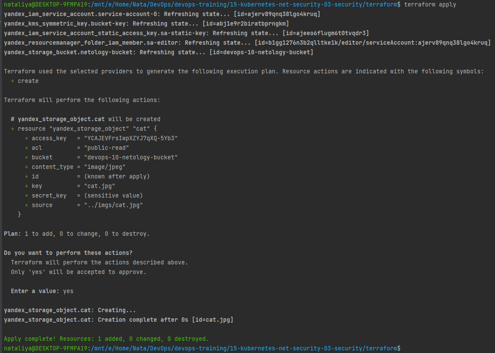
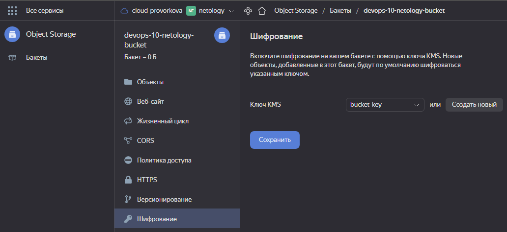

### 15.3. Безопасность в облачных провайдерах - Наталия Проворкова
#### 1. Яндекс.Облако
###### 1. С помощью ключа в KMS необходимо зашифровать содержимое бакета:
* *Создать ключ в KMS,*
* *С помощью ключа зашифровать содержимое бакета, созданного ранее.*
```tf
terraform {
  required_version = ">= 1.0.0"

  required_providers {
    yandex = {
      source = "yandex-cloud/yandex"
    }
  }
}

provider "yandex" {
  cloud_id  = "b1g3s8lnqjnl4svbgr1b"
  folder_id = "b1gg1276n3b2qlltke1k"
  zone      = local.zone
}

locals {
  zone          = "ru-central1-b"
}
```
```tf
resource "yandex_iam_service_account" "service-account-0" {
  name = "netology-service-account"
}

resource "yandex_resourcemanager_folder_iam_member" "sa-editor" {
  folder_id  = yandex_iam_service_account.service-account-0.folder_id
  role       = "editor"
  member     = "serviceAccount:${yandex_iam_service_account.service-account-0.id}"
  depends_on = [yandex_iam_service_account.service-account-0]
}

resource "yandex_iam_service_account_static_access_key" "sa-static-key" {
  service_account_id = yandex_iam_service_account.service-account-0.id
  description        = "static access key for object storage"
  depends_on         = [yandex_iam_service_account.service-account-0]
}
```
```tf
resource "yandex_kms_symmetric_key" "bucket-key" {
  name = "bucket-key"
}
```
```tf
resource "yandex_storage_bucket" "netology-bucket" {
  access_key = yandex_iam_service_account_static_access_key.sa-static-key.access_key
  secret_key = yandex_iam_service_account_static_access_key.sa-static-key.secret_key
  depends_on = [yandex_iam_service_account_static_access_key.sa-static-key]
  bucket     = "devops-10-netology-bucket"
  acl        = "public-read"

  server_side_encryption_configuration {
    rule {
      apply_server_side_encryption_by_default {
        kms_master_key_id = yandex_kms_symmetric_key.bucket-key.id
        sse_algorithm     = "aws:kms"
      }
    }
  }
}

resource "yandex_storage_object" "cat" {
  access_key   = yandex_iam_service_account_static_access_key.sa-static-key.access_key
  secret_key   = yandex_iam_service_account_static_access_key.sa-static-key.secret_key
  depends_on   = [yandex_iam_service_account_static_access_key.sa-static-key]
  bucket       = yandex_storage_bucket.netology-bucket.bucket
  key          = "cat.jpg"
  content_type = "image/jpeg"
  source       = "../imgs/cat.jpg"
  acl          = "public-read"
}
```
export YC_TOKEN="***"
terraform init
<br>terraform validate
<br>terraform fmt
<br>terraform plan
<br>terraform apply
<br>
<br>