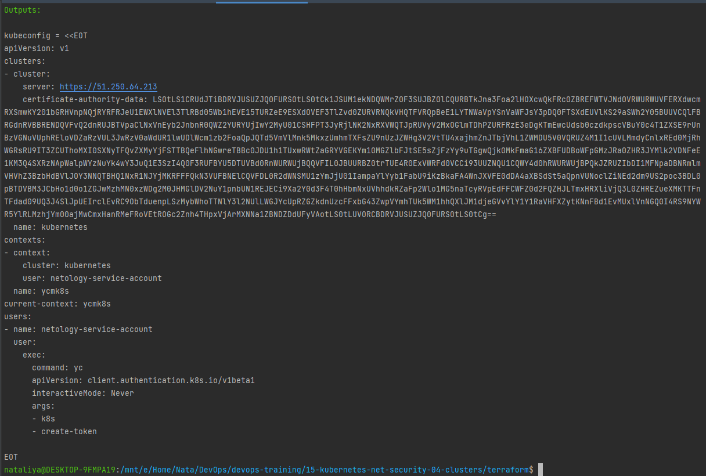
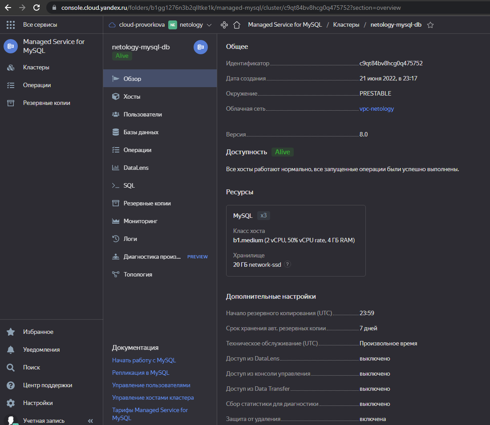
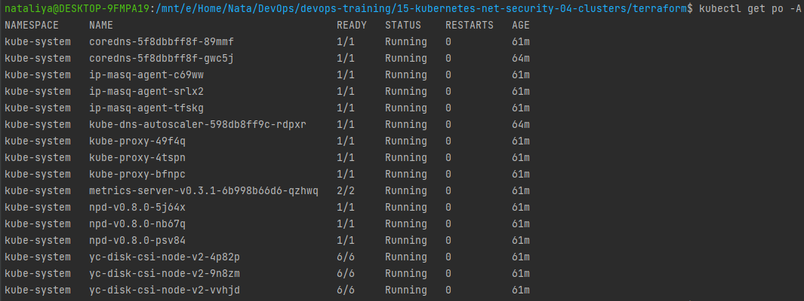

### 15.4. Кластеры. Ресурсы под управлением облачных провайдеров - Наталия Проворкова
#### 1. Яндекс.Облако
###### 1. Настроить с помощью Terraform кластер баз данных MySQL:
* *Используя настройки VPC с предыдущих ДЗ, добавить дополнительно подсеть private в разных зонах, чтобы обеспечить отказоустойчивость*
* *Разместить ноды кластера MySQL в разных подсетях*
* *Необходимо предусмотреть репликацию с произвольным временем технического обслуживания*
* *Использовать окружение PRESTABLE, платформу Intel Broadwell с производительностью 50% CPU и размером диска 20 Гб*
* *Задать время начала резервного копирования - 23:59*
* *Включить защиту кластера от непреднамеренного удаления*
* *Создать БД с именем netology_db c логином и паролем*
```tf
terraform {
  required_version = ">= 1.0.0"

  required_providers {
    yandex = {
      source = "yandex-cloud/yandex"
    }
  }
}

provider "yandex" {
  cloud_id  = "b1g3s8lnqjnl4svbgr1b"
  folder_id = "b1gg1276n3b2qlltke1k"
  zone      = local.zones.central_b.zone_name
}

locals {
  zones = {
    central_a = {
      zone_name = "ru-central1-a"
      private_subnet = ["192.168.20.0/24"]
    }
    central_b = {
      zone_name = "ru-central1-b"
      private_subnet = ["192.168.21.0/24"]
    }
    central_c = {
      zone_name = "ru-central1-c"
      private_subnet = ["192.168.22.0/24"]
    }
  }

  zones_k8s = {
    a = {
      zone_name = "ru-central1-a"
      public_subnet = ["192.168.10.0/24"]
      private_subnet = ["192.168.50.0/24"]
    }
    b = {
      zone_name = "ru-central1-b"
      public_subnet = ["192.168.11.0/24"]
      private_subnet = ["192.168.51.0/24"]
    }
    c = {
      zone_name = "ru-central1-c"
      public_subnet = ["192.168.12.0/24"]
      private_subnet = ["192.168.52.0/24"]
    }
  }

  db = {
    name     = "netology_db"
    user     = "netology"
    password = "ntlg13579!"
  }

  k8s = {
    region = "ru-central1"
    version = "1.21"
  }
}
```
```tf
resource "yandex_vpc_network" "vpc-0" {
  name = "vpc-netology"
}
```
```tf
resource "yandex_vpc_subnet" "public" {
  for_each = local.zones_k8s
  zone           = each.value.zone_name
  network_id     = yandex_vpc_network.vpc-0.id
  v4_cidr_blocks = each.value.public_subnet
}

resource "yandex_vpc_subnet" "private" {
  for_each = local.zones
  zone           = each.value.zone_name
  network_id     = yandex_vpc_network.vpc-0.id
  v4_cidr_blocks = each.value.private_subnet
}
```
```tf
resource "yandex_mdb_mysql_cluster" "netology-mysql-db" {
  name        = "netology-mysql-db"
  environment = "PRESTABLE"
  network_id  = yandex_vpc_network.vpc-0.id
  version     = "8.0"

  resources {
    resource_preset_id = "b1.medium"
    disk_type_id       = "network-ssd"
    disk_size          = 20
  }

  maintenance_window {
    type = "ANYTIME"
  }

  backup_window_start {
    hours = 23
    minutes = 59
  }

  deletion_protection = true

  database {
    name = local.db.name
  }

  user {
    name     = local.db.user
    password = local.db.password
    permission {
      database_name = local.db.name
      roles         = ["ALL"]
    }
  }

  dynamic "host" {
    for_each = local.zones
    content {
      zone = host.value.zone_name
      subnet_id = yandex_vpc_subnet.private[host.key].id
      name = "db-host-${host.key}"
    }
  }
}
```
###### 2. Настроить с помощью Terraform кластер Kubernetes
* *Используя настройки VPC с предыдущих ДЗ, добавить дополнительно 2 подсети public в разных зонах, чтобы обеспечить отказоустойчивость*
* *Создать отдельный сервис-аккаунт с необходимыми правами*
* *Создать региональный мастер kubernetes с размещением нод в разных 3 подсетях*
* *Добавить возможность шифрования ключом из KMS, созданного в предыдущем ДЗ*
* *Создать группу узлов состояющую из 3 машин с автомасштабированием до 6*
* *Подключиться к кластеру с помощью kubectl*
```tf
resource "yandex_vpc_subnet" "private_k8s" {
  for_each = local.zones_k8s
  zone           = each.value.zone_name
  network_id     = yandex_vpc_network.vpc-0.id
  v4_cidr_blocks = each.value.private_subnet
}
```
```tf
resource "yandex_iam_service_account" "service-account-0" {
  name = "netology-service-account"
}

resource "yandex_resourcemanager_folder_iam_member" "sa-editor" {
  folder_id  = yandex_iam_service_account.service-account-0.folder_id
  role       = "editor"
  member     = "serviceAccount:${yandex_iam_service_account.service-account-0.id}"
  depends_on = [yandex_iam_service_account.service-account-0]
}

resource "yandex_resourcemanager_folder_iam_member" "sa-images-puller" {
  folder_id  = yandex_iam_service_account.service-account-0.folder_id
  role       = "container-registry.images.puller"
  member     = "serviceAccount:${yandex_iam_service_account.service-account-0.id}"
  depends_on = [yandex_iam_service_account.service-account-0]
}

resource "yandex_kms_symmetric_key" "k8s-key" {
  name = "k8s-key"
}
```
```tf
resource "yandex_kubernetes_cluster" "netology-control-plane" {
  name        = "netology-control-plane"
  network_id = yandex_vpc_network.vpc-0.id

  master {
    regional {
      region = local.k8s.region

      dynamic location {
        for_each = local.zones_k8s
        content {
          zone    = yandex_vpc_subnet.public[location.key].zone
          subnet_id = yandex_vpc_subnet.public[location.key].id
        }
      }
    }

    version   = local.k8s.version
    public_ip = true
   }

  service_account_id      = yandex_iam_service_account.service-account-0.id
  node_service_account_id = yandex_iam_service_account.service-account-0.id
  depends_on = [
    yandex_vpc_network.vpc-0,
    yandex_vpc_subnet.public,
    yandex_iam_service_account.service-account-0,
    yandex_resourcemanager_folder_iam_member.sa-editor,
    yandex_resourcemanager_folder_iam_member.sa-images-puller,
    yandex_kms_symmetric_key.k8s-key
  ]

  release_channel = "STABLE"

  kms_provider {
    key_id = yandex_kms_symmetric_key.k8s-key.id
  }
}
```
```tf
resource "yandex_kubernetes_node_group" "netology-cluster-workers" {
  for_each = local.zones_k8s
  cluster_id  = yandex_kubernetes_cluster.netology-control-plane.id
  name        = "netology-cluster-nodegroup-${each.key}"
  version     = local.k8s.version

  instance_template {
    platform_id = "standard-v2"

    network_interface {
      nat                = true
      subnet_ids         = [yandex_vpc_subnet.public[each.key].id]
    }

    resources {
      memory = 2
      cores  = 2
    }

    boot_disk {
      type = "network-ssd-nonreplicated"
      size = 93
    }

    scheduling_policy {
      preemptible = true
    }

    container_runtime {
      type = "containerd"
    }

    metadata = {
      ssh-keys = "ubuntu:${file("~/.ssh/id_rsa.pub")}"
    }
  }

  scale_policy {
    auto_scale {
      min = 1
      max = 2
      initial = 1
    }
  }

  allocation_policy {
    location {
      zone = each.value.zone_name
    }
  }
}
```
```tf
output "kubeconfig" {
  value = <<KUBECONFIG
apiVersion: v1
clusters:
- cluster:
    server: ${yandex_kubernetes_cluster.netology-control-plane.master[0].external_v4_endpoint}
    certificate-authority-data: ${base64encode(yandex_kubernetes_cluster.netology-control-plane.master[0].cluster_ca_certificate)}
  name: kubernetes
contexts:
- context:
    cluster: kubernetes
    user: ${yandex_iam_service_account.service-account-0.name}
  name: ycmk8s
current-context: ycmk8s
users:
- name: ${yandex_iam_service_account.service-account-0.name}
  user:
    exec:
      command: yc
      apiVersion: client.authentication.k8s.io/v1beta1
      interactiveMode: Never
      args:
      - k8s
      - create-token
KUBECONFIG
}
```
export YC_TOKEN="***"
terraform init
<br>terraform validate
<br>terraform fmt
<br>terraform plan
<br>terraform apply
<br>
<br>
<br>